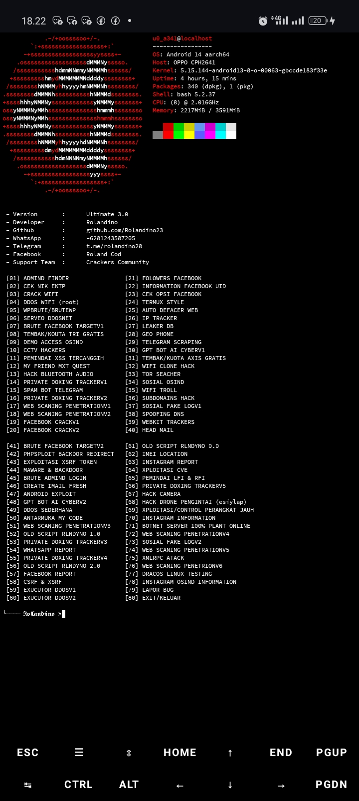

<p align="center">
  <a href="https://wa.me/6281243587205" target="_blank">
    
  </a>
</p>

<p align="center">
  <a href="https://www.facebook.com/profile.php?id=100094471519310" target="_blank">
    
  </a>
</p>

<p align="center">
  <a href="https://t.me/rolandino28" target="_blank">
    
  </a>
</p>

### Preview
<p align="center">
  
</p>

<h3 align="center">
  <marquee behavior="scroll" direction="left" scrollamount="6">
     Ultimate 3.0 
  </marquee>
</h3>

# RLNDYNO - ULTIMATE 3.0 ⚔️
> **Ethical Hacking & Pentesting Toolkit Terminal Interface** 👨‍💻  
> 🚨 **FOR EDUCATIONAL & RESEARCH PURPOSES ONLY!** 🚨


## Instalasi Program Script 🎭
```bash
#Instalasi 🎭
pkg update && pkg upgrade
pkg install git
pkg install python -y
pip install --upgrade pip
pip install requests
pip install bs4
pip install colorama
pip install rich
pip install pytz
git clone https://github.com/Rolandino777/ULTIMATE-3.0.git
cd ULTIMATE-3.0
python3 -m pip install -r requirements.txt
bash install.sh
git pull
bash ULTIMATE.sh 
